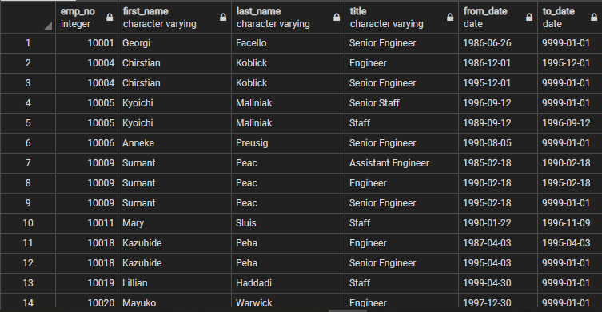
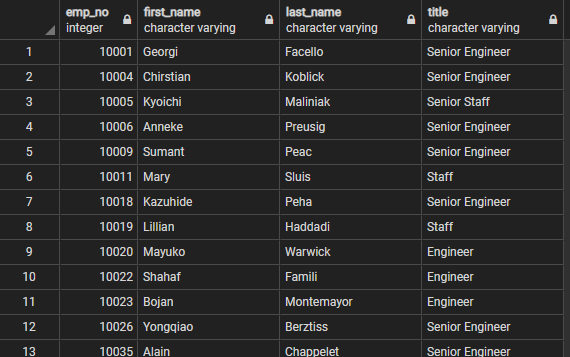
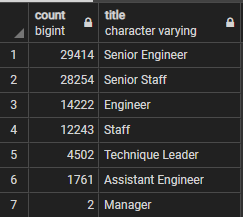
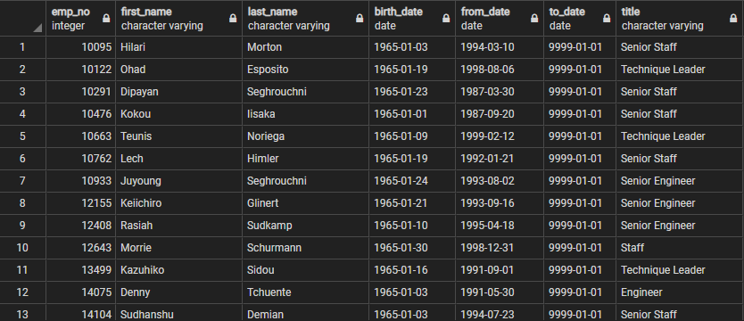
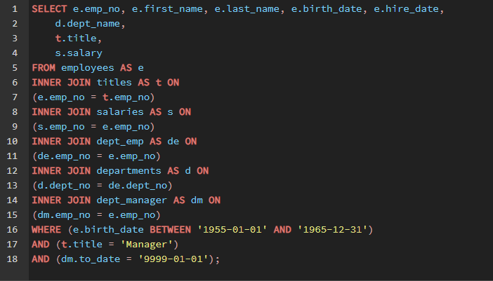
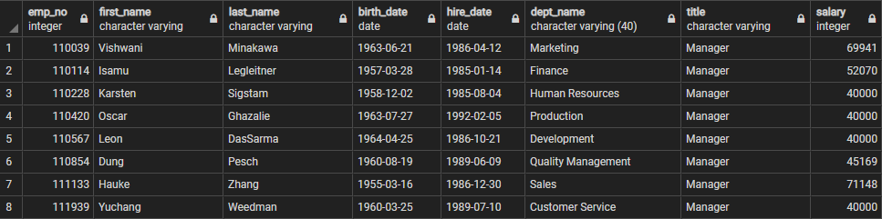
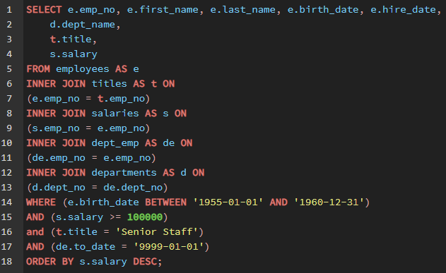

# Pewlett Hackard Analysis

## Project Overview
The assignment was to determine the number of retiring employees per title, and
identify employees who are eligible to participate in the mentorship program.
This report will summarize the analysis completed to help prepare for the
"silver tsunami" as many current employees reach retirement age.

## Resources
- Data Source: departments.csv, employees.csv, dept_emp.csv, saleries.csv,
  titles.csv, dept_manager.csv
- Software: PostgreSQL 12, pgAdmin 4, Visual Code Studio 1.49.3, Atom 1.51.0 x64

## Results
1. After writing the first query, it was revealed that there are duplicate entries of employees due to them switching roles within the company. This potentially could also include employees that have already retired.

2. The second query was to clean up the results of the first query by adding a
  'DISTINCT ON' statement to retrieve the first occurrence of the employee
  number and eliminating the rows of previous roles.

3. The third query used a 'COUNT' and 'GROUP BY' statement to return roles and
  their count of employees that were born between January 1st, 1952 and December
  31, 1955. This answers the question of the number of retiring employees per
  title.

4. The forth and final query answered the question of which employees were eligible
  to participate in the mentorship program. Using a 'DISTINCT ON' statement on
  the employee id to return the most recent entry. Multiple inner joins were made
  to obtain specific fields from specific tables. The 'WHERE' clause was used to
  return employees born between January 1st, 1965 and December 31st, 1965 and a
  'To Date' = '9999-01-01', meaning that they are still working at the company.

## Summary
Through fairly simple queries on the database, we were able to create some new
tables and export them to CSV, that answered the questions of the number of retiring
employees per title and which employees were eligible to participate in the
mentorship program.

- Another query that could be helpful would be to get a list of the Managers still
employed with company that are between 55 - 65 years old.

- This table could be valuable as these are key staff that will be leaving the
company within the next decade. They have been with the company for decades and
would be great candidates to lead the mentorship program. It would also be important to start thinking about their replacements.

- A second query that could be of value would be to retrieve all the Senior staff
making over 100K a year and between the ages 50 - 65.

- This table could be of value as these are staff that are highly paid and have
much life and work experience that could be utilized for the mentorship program.
